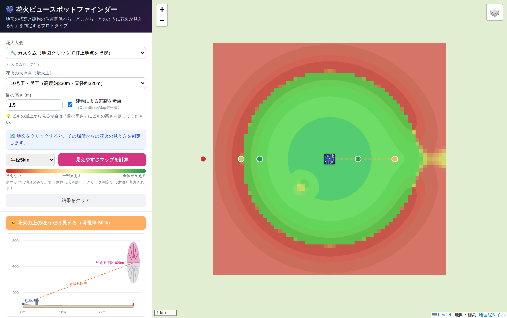
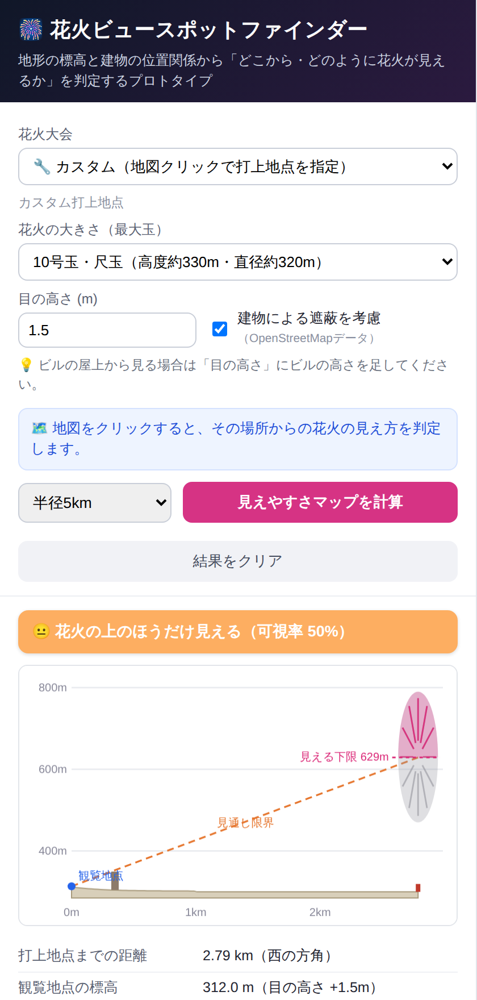

# 🎆 花火ビュースポットファインダー（プロトタイプ）

花火大会を選ぶと周辺の地図を表示し、**「どの場所から・花火がどのように見えるか」** を
地形の標高・地球の湾曲・建物の位置関係から判定するWebアプリのプロトタイプです。

| 見えやすさマップ | 地点判定（断面図） |
|---|---|
|  |  |

> ※上のスクリーンショットは、オフライン環境の自動テストで生成した**合成地形（架空の湖＋外輪山＋東の峠＋手前のビル）**によるものです。実際にブラウザで開くと、国土地理院の実標高データと実際の地図で動作します。

## できること

- **花火大会を選択** — 主要大会のプリセット（座標・玉サイズはデモ用概略値）、または「カスタム」で地図クリックにより任意の打上地点を指定
- **地図をクリック → その場所からの見え方を判定**
  - 可視率（花火の開花球のうち何%が見えるか）と6段階カテゴリ（🌟絶好〜🙈見えない）
  - **断面図**: 観覧地点→打上地点の地形プロファイル、視線の限界、建物、花火の見える部分（ピンク）／隠れる部分（グレー）
  - 距離・方角・仰角・見かけの大きさ（満月の◯倍）・遮蔽している地形や建物の情報
- **建物による遮蔽** — OpenStreetMapの建物（高さタグ or 階数から推定）を視線上で判定
- **見えやすさマップ** — 打上地点の周囲（半径3/5/8km）を61×61グリッドで計算し、赤（見えない）〜緑（全体が見える）で色分け表示
- **玉サイズ（3号〜三尺玉）・目の高さ（ビル屋上観覧など）** を変更して再判定

## 使い方

ビルド不要の静的アプリです。

```bash
# 方法1: そのまま開く
open public/index.html          # ダブルクリックでも可

# 方法2: ローカルサーバ
cd public && python3 -m http.server 8000

# 方法3: Firebase Hosting にデプロイ（このリポジトリはhosting設定済み）
firebase deploy --only hosting
```

標高タイル・地図タイル・建物データは実行時にブラウザから直接取得するため、インターネット接続が必要です。

## 判定の仕組み

1. **標高取得** — [国土地理院 標高タイル](https://maps.gsi.go.jp/development/demtile.html)（PNG形式）をブラウザで取得・デコード。5mメッシュ `dem5a_png`(z15) を優先し、無ければ10mメッシュ `dem_png`(z14) にフォールバック。画素値 `x = 2^16·R + 2^8·G + B` から `h = 0.01x` m（`x=2^23`は無効値、超過は負値）。
2. **見通し判定** — 観覧地点の目の高さから打上地点方向へ、視線に沿って約25〜50m間隔で地表をサンプリング。地球の湾曲＋大気屈折は実効地球半径 `R_eff ≈ 7,420km`（屈折係数k≈0.14）を使い、実効高さ `z_eff = h − d²/(2·R_eff)` の空間で直線視線として扱う。全障害物の最大仰角勾配から、打上位置で見通せる**下限標高（cutoff）**を求める。
3. **可視率** — 花火の開花球（打上地点の標高＋号数ごとの開花高度±開花半径）のうち、cutoffより上にある割合。
4. **建物** — Overpass APIで視線の±40mコリドー（最大8km）の建物を取得し、視線と建物ポリゴンの交差位置・建物上端の仰角を障害物に加える。高さは `height`タグ → `building:levels`×3.3m → 既定値8m の順で推定。
5. **見えやすさマップ** — 周囲を格子状に同じ計算（地形のみ・建物なし）で塗り分け。

## 精度と限界（正直な注意書き）

- 樹木・煙・観客の頭・フェンス・照明・**立入可否**は考慮していません
- OSMの建物は高さタグが無いものが多く推定になるほか、multipolygon（relation）建物は未対応
- プリセット大会の打上座標・玉サイズは**デモ用の概略値**です（`js/festivals.js` を編集して調整可能）
- 標高は5〜10mメッシュのため、細かい堤防・切通しなどは表現しきれません。海・湖などの水面は無効値になる場合があり、周辺標高からの推定で補っています
- 判定は打上「中心」への視線です。横方向に広い開花の端がビルの縁で欠けるケースは簡略化しています

## テスト

```bash
# 数理コア（依存なし）: タイル座標・PNG標高デコード・見通し/湾曲/建物遮蔽の数値検証
node tools/test-los.mjs

# ブラウザE2E（要 npm i playwright-core pngjs）:
# 地理院タイル・Overpassを合成地形でスタブし、全経路をオフライン検証＋スクリーンショット生成
node tools/smoke-e2e.mjs
```

## 本格化に向けた発展案

- **[PLATEAU](https://www.mlit.go.jp/plateau/)（国交省 3D都市モデル）** の建物データ（LOD1/2）で、高さの正確な建物遮蔽・屋上観覧判定
- サーバ側で全国の可視領域（viewshed）を事前計算してタイル配信 → クリック待ち時間ゼロ・広域表示
- 大会データベース（正確な打上座標・開催日・プログラム・最大号数）の整備
- 混雑予測・穴場スコア、現地写真のクラウドソーシング、GPSで「今いる場所の見え方」
- 開花球を複数レイで判定（左右端の欠け）、スターマイン等の低高度演出の別判定

## データ出典・利用条件

- 標高・地図: **国土地理院 地理院タイル**（[利用規約](https://maps.gsi.go.jp/development/ichiran.html)に基づき出典を明示して利用）
- 建物: **© OpenStreetMap contributors**（[ODbL](https://www.openstreetmap.org/copyright)） / Overpass APIは共用サーバのため高頻度アクセスは避けてください

## ファイル構成

```
public/
├── index.html        # 画面
├── css/style.css
├── js/
│   ├── festivals.js  # 大会プリセット・玉サイズ諸元（編集して調整）
│   ├── geo.js        # 距離・方位・地球湾曲などの測地ヘルパー
│   ├── elevation.js  # 地理院標高タイルの取得・デコード・キャッシュ
│   ├── buildings.js  # Overpassで建物取得・視線との交差判定
│   ├── los.js        # 見通し解析コア（可視率・カテゴリ判定）
│   ├── profile.js    # 断面図の描画
│   ├── heatmap.js    # 見えやすさマップの計算・描画
│   └── app.js        # UI・地図のオーケストレーション
└── vendor/leaflet/   # Leaflet 1.9.4 同梱

tools/
├── test-los.mjs      # 数理コアのユニットテスト（依存なし）
└── smoke-e2e.mjs     # 合成地形によるブラウザE2Eテスト
```
