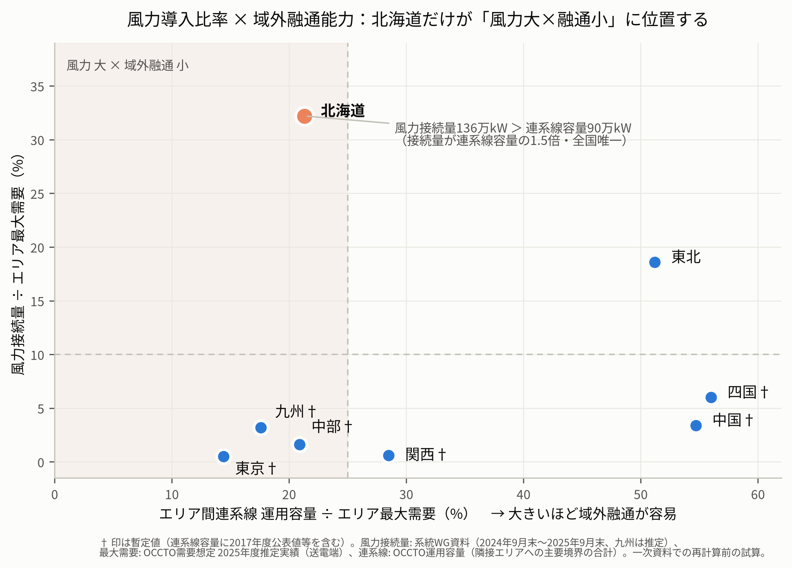

# 北海道における「風力主導の蓄電池増加」の定量的根拠

- 位置づけ: `research-plan.md`（研究計画書本体）§1.3「なぜ北海道か」を定量的に補強する分析ノート。論文第2章（制度的背景）・第1章（序論）の素材
- 作成日: 2026年7月26日
- データの確度: 本ノートの数値はWeb調査（検索経由）で収集した公表値であり、**時点の混在と要一次確認の値を含む暫定版**。§6の手順で一次資料から確定させること

---

## 1. 主張と論理構造

> **主張**: 北海道では、太陽光ではなく**風力**を主因とする蓄電池の増加が進む。理由は、①風力導入量がエリア需要に対して全国で突出して大きく、かつ②エリア間連系線の制約により風力の変動・余剰を他エリアへ融通することが難しいため、**風力起因の残余需要変動をエリア内で吸収する経済的必要（＝蓄電池の裁定機会）がエリア内に閉じ込められて発生する**からである。

論理チェーン:

```
① 風力/需要比が全国最大（32%、次点東北19%）
② 風力接続量(136万kW) ＞ 連系線容量(90万kW) — 全国唯一の逆転
        │
        ▼
風力の変動・余剰は物理的に域外へ逃がしきれない（市場分断・出力制御として顕在化）
        │
        ▼
北海道エリアプライスに変動が集中（スプレッド・ボラティリティの域内閉じ込め）
        │
        ▼
裁定機会がエリア内で完結 → 蓄電池の参入インセンティブが北海道に集中
（実績: 接続申込160万kW＝平均需要の約5割、2022年7月末時点で全国最大級）
```

重要な注意: ②「融通の細さ」**単体**では九州も北海道と同水準である（連系線/最大需要比: 九州約18% vs 北海道16〜21%）。北海道を特徴づけるのは**①×②の複合**、すなわち「風力が大きい×融通が細い」の同時成立であり、これは全国で北海道だけに当てはまる（図1）。九州は「太陽光大×融通小」の先行事例であり、太陽光主導の蓄電池・カニバリゼーションは九州・CAISOで既に研究がある。**「風力主導」の均衡分析が空白であることが本研究の新規性の核**になる。



---

## 2. ①風力導入量の比較：絶対量と需要比

### 2.1 エリア別の風力接続量と需要比（暫定値）

| エリア | 風力接続量（時点） | 最大需要※1 | **風力/最大需要** | 太陽光接続量 | VREに占める風力比率 |
|---|---|---|---|---|---|
| **北海道** | **136万kW**（2024年9月末） | 422万kW | **約32%** | 236万kW（2025年3月末・見通し前提値か。2024年9月末実績は231万kW） | **37%** |
| 東北 | 241.5万kW（2025年9月末） | 1,296万kW | 約19% | 779.7万kW | 24% |
| 四国 | 28万kW（2021年12月末・古い） | 464万kW | 約6% | 309万kW | 8% |
| 中国 | 34万kW（2025年9月末） | 1,002万kW | 約3.4% | 738万kW | 4.4% |
| 九州 | 約50万kW（推定・要確認） | 1,576万kW | 約3.2% | 1,000万kW超 | 約5% |
| 中部 | 38万kW（2024年9月末） | 2,347万kW | 約1.6% | 1,182万kW | 3.1% |
| 東京 | 僅少（単独値未確認） | 5,453万kW | 1%未満 | VRE計2,216万kW | ごく小 |
| 関西 | 17万kW（2024年9月末） | 2,691万kW | 約0.6% | 751万kW | 2.2% |

※1 OCCTO「2026年度需要想定」の2025年度推定実績・送電端（万kW）。北海道は冬季ピーク型のため、冬季H1想定（567万kW）を分母にすると風力/需要比は約24%に下がるが、それでもなお全国最大。

**読み取り**:
- **需要比では北海道（約32%）が突出**。次点の東北（約19%）を大きく引き離し、3位以下は6%以下。
- **絶対量は表現に注意が必要**: エリア単位では東北（241.5万kW）が最大で北海道は2位。ただし**都道府県単位では北海道が2024年末に全国1位**（約1,281MW、2024年単年+455MWは全国増加分の約7割。石狩湾新港洋上風力112MWの運開等が寄与。JWPA調べ）。論文では「都道府県単位で導入量全国1位」「需要規模比で全国唯一の突出」という2つの正確な表現を使い分ける。
- **VRE構成の中で風力のウェイトが高い（37%）のも北海道の特徴**。他エリアはいずれも太陽光が圧倒的（風力比率は東北24%を除き10%未満）。「太陽光主導の九州 vs 風力主導の北海道」という対比が成立する。

### 2.2 将来: 洋上風力で差はさらに開く

| 項目 | 北海道 | 東北（比較対象） |
|---|---|---|
| 促進区域 | 松前沖・檜山沖（2025年7月指定、檜山沖は約91〜114万kWで国内最大級） | 秋田4海域・青森1・山形1など選定済み計約290万kW（由利本荘70万kW級は2025年8月に選定事業者撤退） |
| 有望区域等 | 石狩市沖（91〜114万kW・国内最大級）・岩宇及び南後志地区沖（最大70.5万kW）・島牧沖 | 12海域で案件形成中 |
| 規模見通し | **5海域合計 最大約380万kW**（2023年10月時点整理） | 2030年まで最大533万kW、2040年まで最大900万kW（東北経産局） |
| **対最大需要比** | **約90%**（380/422） | 約41%（533/1,296、2030年）〜約70%（900/1,283、2040年） |

洋上風力を織り込むと、北海道の風力/需要比は**需要とほぼ同規模（約90%）**に達しうる。これは研究計画の再エネシナリオ R の上限側を規定する数字であり、「風力起因のボラティリティが構造的に支配的になる」という前提の根拠になる。

---

## 3. ②連系線制約：容量・分断率・値差

### 3.1 連系線容量の需要比（暫定値）

| エリア | 主要境界と運用容量 | 対最大需要比 |
|---|---|---|
| **北海道** | 北本連系設備 **90万kW**（直流。本州向き90、北海道向き月により70〜90） | **16%**（冬季H1 567万kW比）〜21%（422万kW比） |
| 九州 | 関門連系線 中国向き約278万kW | 約18% |
| 東京 | FC 210万kW＋東北からの受電573万kW | 約14% |
| 中部 | FC・対関西・対北陸 計約490万kW | 約21% |
| 関西 | 対中部・北陸・中国・四国 計約767万kW | 約29% |
| 東北 | 東京向き573万kW（2027年11月に1,028万kWへ）＋北本 | 約51% |
| 四国 | 阿南紀北140万kW＋本四120万kW | 約56% |

**キー指標 — 風力接続量 ÷ 連系線容量**（風力を域外に逃がせない度合い）:

| エリア | 風力接続量/連系線容量 |
|---|---|
| **北海道** | **136/90 = 約1.5倍（全国唯一の1超）** |
| 東北 | 241.5/663 ≒ 0.36 |
| 九州 | 約50/278 ≒ 0.18 |
| その他 | いずれも0.1未満 |

北海道は**既存の風力接続量だけで連系線容量を5割上回っており**、洋上風力（最大380万kW）が加われば比率は約5.7倍に達する。北本120万kW化（2027年度末）後でも約4.3倍であり、**構造的に「風力はエリア内で吸収するしかない」**ことが確定的である。日本海ルートHVDC 200万kW（構想・整備計画審議中、概算1.5〜1.8兆円）が実現しても約1.6倍で、なお1を超える。

### 3.2 市場分断の実績

- 北本連系設備の市場分断発生率: **2023年度 年間平均8.5%**（OCCTO広域系統整備委員会資料）、2024年度は前年比増加傾向。
- 歴史的には2021〜22年頃に**北本・FC（東京中部間）の分断発生率が3カ月平均78〜85%**に達した時期がある（エネ庁ベースロード市場関連資料）。分断の主舞台は年度により北本⇔FC⇔関門で移り変わるため、論文では**複数年度の推移**を示すことが頑健（単年度の8.5%だけに依拠しない）。
- 制度面の傍証: ベースロード市場の市場画定は、北本・FCの分断頻発を根拠に**東日本（北海道・東北・東京）/西日本/九州の3分割**とされている。容量市場でも市場分断により北海道・九州が高値約定（第3回メインオークション）。**スポット以外の市場でも北海道の連系線制約が価格に波及**している。

### 3.3 値差の水準と「方向」

- 過去実績: 2017年度の北海道—東北間の年平均値差は**1.98円/kWh**（エネ庁 間接送電権関連資料）。
- **決定的に重要なのは値差の「方向」の変化**: JEPX・エネ庁「間接送電権の制度・在り方等に関する検討会とりまとめ」（2025年3月26日）は、2023年4月〜2024年3月の値差実績に基づき**「北海道→東北（順方向）」の値差期待値が0.01円/kWhを上回る**として2026年度からの商品化対象に追加した。これは近年、**北海道側が安値・東北側が高値の向きに分断する（＝再エネ余剰が北海道内に閉じ込められて価格を押し下げる）パターンが支配的**になったことを意味する。
- かつての北海道は「需給逼迫時に高値方向へ乖離するエリア」だったが、再エネ導入の進展により「余剰時に安値方向へ乖離するエリア」へ転じつつある。この**双方向の乖離こそが蓄電池の裁定機会**であり、②が①と結合して蓄電池需要を生む経路の直接の証拠になる。

---

## 4. 蓄電池側の突合：予測ではなく既に観測されている

「風力主導の蓄電池増加」は将来予測であると同時に、**すでに観測されつつある現象**である。

1. **制度としての先行**: 北海道は2015年〜2023年7月まで、風力・太陽光の接続に**蓄電池併設を要件とする「北海道ルール」**が存在した唯一のエリア（出力変動緩和対策）。北豊富変電所240MW/720MWh（2023年3月稼働、国内最大級）は道北風力送電網の併設蓄電池であり、**「風力→蓄電池」の因果が制度として具現化した事例**。
2. **市場主導の集中**: 系統用蓄電池の接続申込は2022年7月末時点で**61件・160万kW＝エリア平均需要（約350万kW）の約5割**と、需要規模比で全国最大級。市場裁定型の大型案件（札幌50MW/100MWh、2025年11月運開等）も進む。
3. **含意**: 本研究の均衡モデルは、この観測された集中を「風力/需要比×連系線制約→スプレッド→参入」のメカニズムとして構造的に説明し、その到達点 K\* を予測するものと位置づけられる。

---

## 5. 論文への組み込み方

- **序論・第2章**: 図1（風力導入比率×域外融通能力の散布図）と§2・§3の表を、対象選択（なぜ北海道か・なぜ風力か）の定量的根拠として提示。
- **モデルとの接続**: ①は残余需要の変動項（風力出力の分散・自己相関）として、②は分断レジーム（北本潮流の制約到達）としてモデルに入る。すなわち本ノートの2要因は、研究計画の構造モデル（`research-plan.md` §4.2）のパラメータそのものである。
- **新規性の主張**: 「太陽光主導」のスプレッド（日次サイクル・ダックカーブ）と「風力主導」のスプレッド（数日周期の総観規模気象変動）は時間構造が異なり、**必要とされる蓄電池のduration（継続時間）も異なりうる**。太陽光型の4時間電池研究（九州・CAISO）に対し、風力型の均衡分析は方法論的にも空白 — この論点は指導教員と議論のうえ、均衡モデルにduration選択を組み込むか検討する価値がある（研究計画§4.3の拡張）。

---

## 6. 一次資料での確定手順（着手時タスク）

暫定値を論文品質にするための具体的手順:

1. **風力・太陽光接続量（全エリア・同一断面）**: 第6回次世代電力系統WG（2025年12月24日）の資料一式に全エリアの2025年9月末接続量が掲載されているはず。資源エネルギー庁まとめ資料（`smart_power_grid_wg/pdf/006_01_00.pdf`）と各社参考資料1-1〜1-9から転記し、**2025年9月末断面で統一**する。
2. **エリア別需要**: OCCTO「2026年度 全国及び供給区域ごとの需要想定」（2026年1月21日）の原典PDFから最大需要（送電端）を転記。年間需要電力量はOCCTO「電力需給及び電力系統に関する概況（2024年度実績）」表1-5から。北海道は冬季最大（H1）も併記し、比率は両方の分母で計算。
3. **連系線運用容量**: OCCTO「2026〜2035年度 連系線の運用容量（別紙1）」から月別値を取得し、年平均または代表月で統一（2017年度値の暫定値を置換）。
4. **分断率**: 電力・ガス取引監視等委員会「制度設計専門会合」の市場分断モニタリング資料またはJEPX取引監視四半期報告から、連系線別・年度別の分断率時系列を作成（jepx.infoの集計は照合用）。
5. **値差**: JEPXスポットCSVから北海道—東北・北海道—システムの値差分布（平均・分位点・方向別頻度）を自計算。間接送電権とりまとめPDFの期待値差の表と突合。
6. **JWPA導入量**: JWPAプレスリリース原典で2024年末値（5,840.4 vs 5,849.4MWの版差）を確定。
7. 図1を確定データで再作成（時点統一後は†注記を除去）。

**主な出典**（詳細は`notes/02`・`notes/06`および本文中の機関名・資料名を参照）: 経産省 次世代電力系統WG各回資料、OCCTO（需要想定・連系線運用容量・広域系統整備委員会・電力需給概況）、JEPX・エネ庁 間接送電権検討会とりまとめ（2025年3月26日）、電力・ガス取引監視等委員会 制度設計専門会合、JWPA、東北経済産業局、北海道庁。
